#            The SWAN-MBR Correlation Package                     
 
 The package described in this document is a Software Correlator written for the MBR dataset, specifically for the SWAN system. This software package is mainly written in Cython, with the computationally intensive blocks i.e FFT Kernel in FORTRAN and linked to the Python using f2py. Effort has been made to make to as human redable as possible, though, some functions still lack the robust documentation. If anyone is interested in contributing towards the documentation, please contact: devanshshukla99@outlook.com, pavan.uttarkar@gmail.com
 
 The Correlator design for the Sky-Watch Network Array is a software based FX  Correlator.  Python being an interpreted language, though easy to use and with small turn around time, has inherent disadvantage of being relatively less efficient than it’s compiled peers. Hence for efficient memory management and faster turnaround time, Cython (a C compiled version of python) is used in the pipeline for data/computationally intensive processes. This  includes  IO  operations,  decoding  the  binary  data,  plotting  operations etc..  To  further  make  the  correlator  efficient,  the  Fourier  Transforms  operations are performed using  the  FFTW in FORTRAN, and is linked to this correlator using f2py (a Python wrapper generating module for FORTRAN programs). In this design Python is used as an glue language to link all these modules and to provide high level access to it’s functionality.
 
 ##			Introduction to the Processing		
 
 The processing steps for the correlator are as follows,
 
- Initiation from the user to start the correlation, by giving the requisite information.
	
	    Usage:
	    
		usage: temp_del_after_vGPS.py -f1 <file 1 path> -f2 <file 2 path> -r <RFI Reject 1/0>  -RA <RA in hrs.> -D <Dec in deg.> -a <Packet avergae/ preferebly in multiples of 2> -fft <FFT length/in multiples of 2>
		
		The program is used to correlate RAW Voltage data sets from two DAS machines, with time synchronization
		
		arguments:
	
		  -h, --help    show this help message and exit
		  
		  -g GPSCOMPENSATION, --GPSCompensation GPSCOMPENSATION
		            GPS compensation flag, <1/0>
		  
		  
		  -f1 FILE_NAME1, --file_name1 FILE_NAME1
		                        First file path
		  
		  -f2 FILE_NAME2, --file_name2 FILE_NAME2
		                        Second file path
		  
		  -r RFI_REJECT, --RFI_Reject RFI_REJECT
		                        Use 1 to reject RFI, 0 to pass all channels
		                        
		  -RA RIGHTASCENSION, --RightAscension RIGHT ASCENSION Right Ascention in hrs.
		  
		  -D DECLINATION, --Declination DECLINATION           Declination in deg.
		  
		  -a AVERAGE, --average AVERAGE
		                        Average in packets / preferably in multiples of 2
		                        
		  -fft FOURIERTRANFORMLENGTH, --FourierTranformLength FOURIERTRANFORMLENGTH
		    Length of FFT, i.e if 256, then 128
		

		Example Usage:
		 
		 ./temp_del_after_vGPS.py -g 1 -f1 /media/MBR_8B/20210419/CH01/ch01_SUN_20210419_125703_000.mbr -f2 /media/MBR_8B/20210419/CH02/ch02_SUN_20210419_125703_000.mbr -r 1 -RA 1.8690833333333334 -D 11.621111111111112 -a 60000 -fft 256
 
 -  Initally for any pair of files, the package calculates the synchronization factor, if the gps flag is high. The synchronization factor is calculated by using the gps transitions recorded in the individual packets. The two byte GPS field in the header records the GPS time from the nearest 12'O clock, the header also records the 1PPS active high input from the GPS-Rb Oscillator, in a single bit, along with the GPS counter values. Data from these timming files are used to derive a straight line equation by curve fitting and stored in the HDD. This straight line equation is then used to find the point of synchronization between two files, an example figure below shows this GPS counter vs Time plot, once the point of synchronization is calculated, essentially we have the point where the correlation can be started.
 
<p align="center">
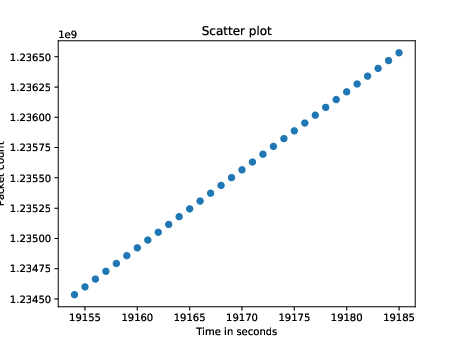 <br />
	Figure 1: Scatter plot of GPS counter values vs time, as seen in recorded file.
 </p>
 
 -  The curve fit method is used for the 000 series files, for non 000 series the inital calculation from the 000 series file is used, along with the compensation for the packet loss. The compensation for the packet loss is done on the fly, a figure describing this can be seen below,
 


<p align="center">
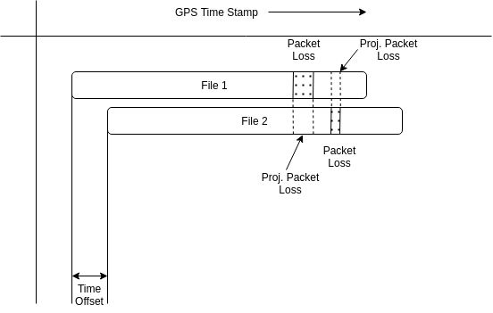 <br />
Figure 2: Packet loss compensation in the correlator.
</p>

The packet loss is accounted for using the help of the packet counter, a 4 byte header in the packet. This accounting should be done to avoid any loss in coherence, as packet loss positions in both the files are uncorrelated and requires dropping of the chunk of the dataset in the corresponding file as well to avoid the drop in coherence.
 
 
 
 - Once time tag for the point of correlation is available, with compensation for the packet loss, the decryptying of the binary file is started. Memory mapping is used to read the files from the Hard Drive, to achieve this, python module memmap, which essentially is a python wrapper for C mmap, is used.  Memory mapping a file has several advantages compared to conventional read write method,  the memory mapped files are read into the address space and makes available required sections of it. This helps in reducing the required IO operations, hence, it is more efficient. Initially only the packet numbers are read, to compensate for the lower level packet loss, as any packet loss is esentially a time jump, or a loss in synchronization between two files, and will lead to decorrelation of the signal. The packet loss compensation is one of the major blocks of the program, the logic is essentially as follows,
      -- create a buffer of 512XPCK
      -- PCK = (initial\_packet - final\_packet)
      -- fill the voltage values from the memory mapped files to the buffer leaving out the lost packet numbered arrays, this is relative w.r.t to start of the file.
      -- fill lost packet numbered arrays with zeros, temporarily.  
- Once a array of volatge values are available on the volatile memory, read from the files, the lost packets are projected on the other files to remove out the packets which do not need to be correlated (refer previous figure).
- These pair of X and Y polarization arrays are then passed on to the FORTRAN90 FFT Kernel to process and produce the Fourier Transforms of these files and to create the correlation matrix, i.e. four auto-correlation, X1, X2, Y1, Y2 and two cross-correlation, X1X2, Y1Y2, spectrums.
- The FORTRAN program uses FFTW for the calculating FFT of the dataset and is interfaced to the Python using f2py, which will create a wrapper, a shared object file, which can be accessed through Python. (Insert the flag used for efficient FFT calculation)

 
  

##			The SWAN datapacket:			

The current data packet structure of the SWAN system is shown in the figure 3. The first 32 bytes of the data 
 
A packet consists of 14 bytes ethernet header, 20 bytes IP header, 8 bytes UDP header, 32 bytes SWAN header, and 1024 bytes of digitized data. The starting headers related to the ethernet, IP and UDP are striped off and only the 32 byte SWAN header and the 1024 byte digitized data is stored during the acquisition.
The new modified SWAN header (refer fig. 3 and fig. 4) was introduced considering the sizeable geographical separation, and complexities arising due to the pointing at different latitudes, pointing information is embedded in the header, in the latest version without modifying the length of the SWAN header, to keep the required backward compatibility.

The SWAN header contains the following parameters,

1. DSP ID (e.g. SWAN01, SWAN05 etc.)
2. Source position (ZA and Az, if sweetspot pointing only sweetspot number os printed)
3. Source name (as provided by the user)
4. Attenuator values (four attenuator values, set by user)
5. LO frequency (as set by the user)
6. FPGA Mon
	IMPORTRANT Bits to look for-
	--Sweetspot bit (if high, then sweetspot pointing; if low, non sweetspot pointing, as pointed by the user)
	-- LO Lock (to check if there was a LO was set)
7. GPS Count (from nearest 12 AM or 12 PM)
8. Packet count (incremental packet counter)

<p align="center">
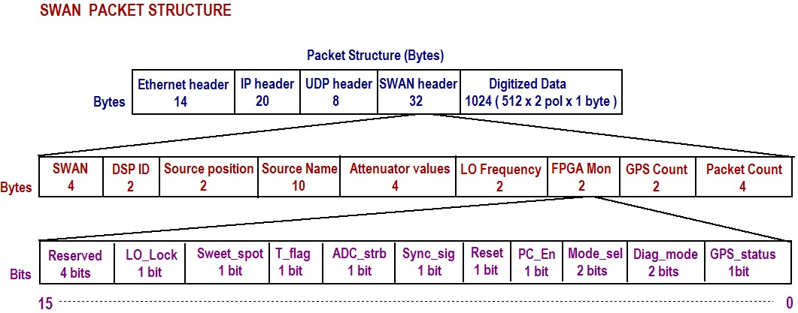 <br />
Figure 3: Modified SWAN Packet Structure, with modifications to the LO lock bit, Sweetspot bit in the FPGA Mon  field and the introduction of pointing field.
</p>

<p align="center">
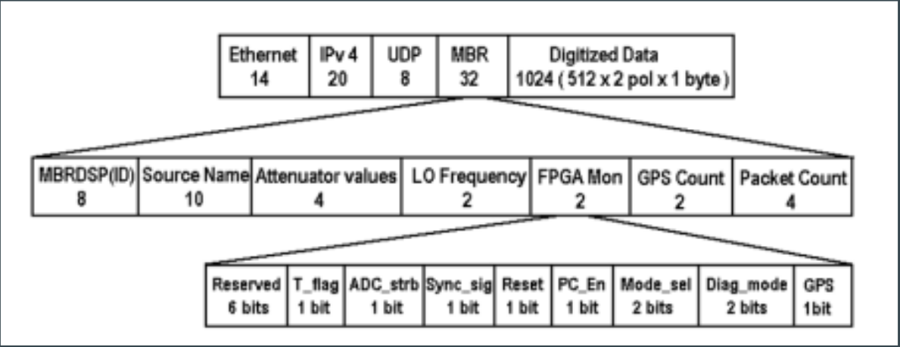 <br />
Figure 4: Legacy MBR (SWAN) Packet Structure.
</p>
 
##	Coherence Loss due to packet loss

Packet loss can cause loss in coherence as a result of time jump experienced by one of the files w.r.t other, this is best illustrated by the fig. 5, fig. 6 and fig.7 below. Hence the packet loss is an important constraint, this is taken care in the correlator software such that the user does not have to worry about the internal compensation of the packet loss. The initial decrypting of the binary file along with reading the document takes up most of the processing time, as it is IO intensive, especially with systems running on HDD, hence it is important to do these calculations and compensation as efficiently as possible with the available memory. 

<p align="center">
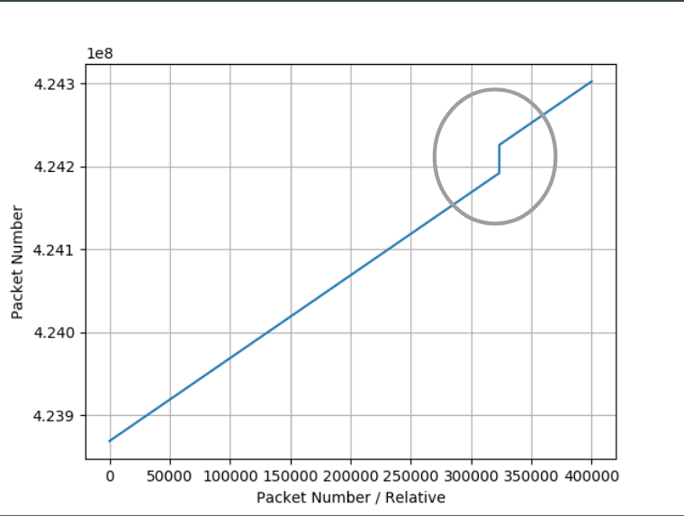 <br />
Figure 5: Noticable jump in the packet number due to the packet loss in an acquisition.
</p> 
 
<p align = "center"> 
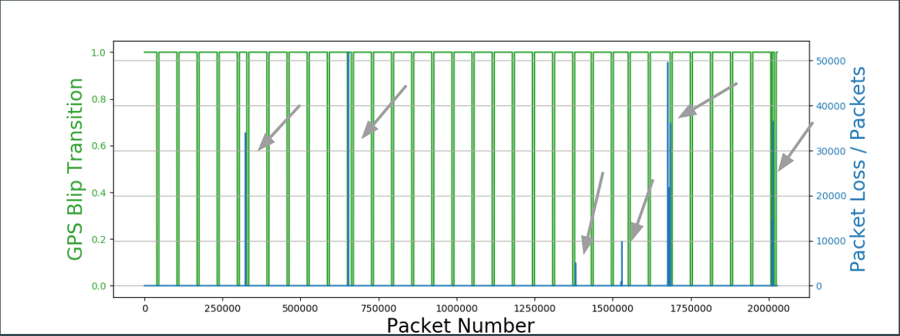 <br />
Figure 6: Packet loss indicator showing the magnitude of packet loss at different GPS blips, due which the width of the individual second, as percieved by the aqusition system is different, which can have downstream effect during correlation.
</p>

<p align="center">
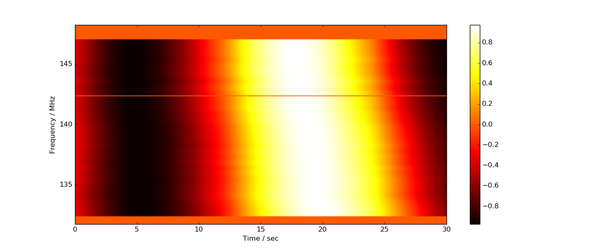
</p>

<p align="center">
(a)
</p>

<p align="center">
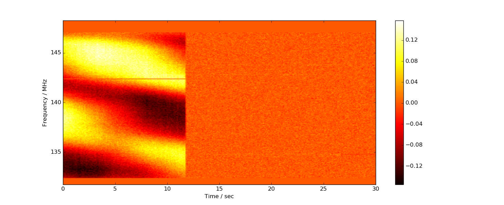
</p>

<p align="center">
(b)
</p>


<p align="center">
Figure 6(a): Correlated spectrum, output of SWAN correlator corrected for the packet loss <br />
Figure 6(b): Correlated spectrum, output of SWAN correlator not corrected for the packet loss.
</p>

##	Correlator Data Products
The correlator produces data products in binary numpy format, the file CORRELATION is used as the parking spot for all the generated outputs, the following naming conventions are used for it,


```
SUN_20210419_20210419/
|-- plot_all.py
|-- X1X2
|-- X1X4
|-- X1X7
|-- X2X4
|-- X2X7
 -- X4X7
 ```
The following files (X1X2, X1X4, etc.) contains the files such as 'Correlation_NoComp_CompX7X1_ch07_SUN_20210419_142210_001.mbr_ch01_SUN_20210419_142210_001.mbr.txt.npy', a data cube containing first 2-D dynamic spectrum as the uncompensated correlation spectrum, the second is the intrasample compensated spectrum and the third 2-D spectrum is the phase used to compensate the uncompensated spectrum. An example 2.5 min and 37 min uncompensated dynamic spectrum can be seen in the fig. 7(a) for 2.5 min Solar observation and 37 min Solar observation in fig. 8(a). Similarly, compensated spectrum for 2.5 min Solar observation can be seen in fig. 7(b) and 37 min observation in fig. 8(b). The correlation amplitude (correlation co-efficient) of the Solar observation taken on April 14th can be seen in fig. 9. This observation was taken on the Tile 1 - Tile 7 baseline, the compensated dynamic spectrum phase can be seen in fig. 10.

<p align="center">
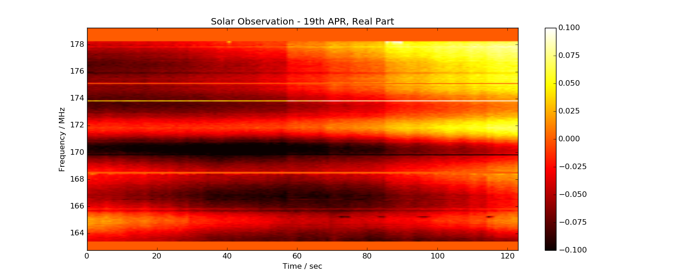
</p>

<p align="center">
(a)
</p>

<p align="center">
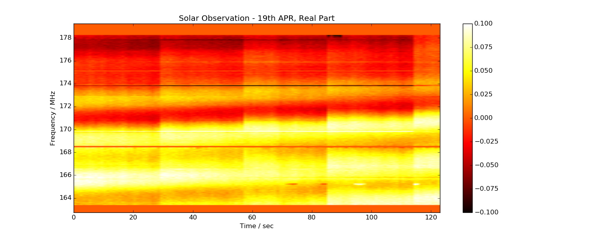
</p>

<p align="center">
(b)
</p>


<p align="center">
Figure 7(a): Cross-Correlated spectrum, output of SWAN correlator not corrected for intra-sample delay. <br />
Figure 7(b): Cross-Correlated spectrum, output of SWAN correlator corrected for intra-sample delay.
</p>


<p align="center">
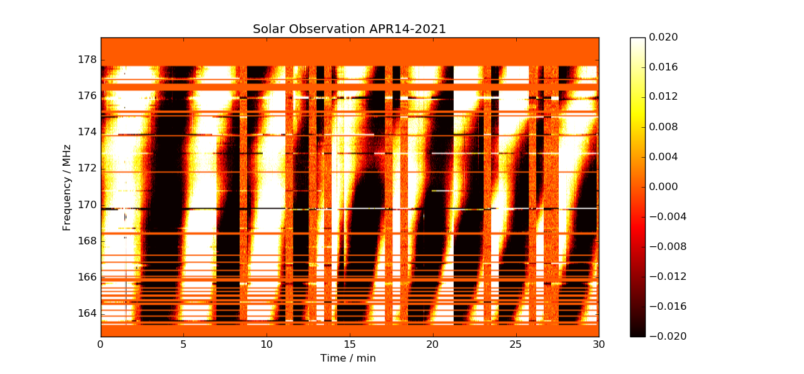
</p>

<p align="center">
(a)
</p>

<p align="center">
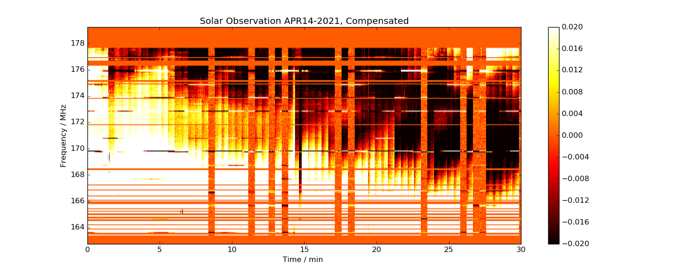
</p>

<p align="center">
(b)
</p>


<p align="center">
Figure 8(a): Cross-Correlated spectrum, output of SWAN correlator not corrected for intra-sample delay, 37 min observation. <br />
Figure 8(b): Cross-Correlated spectrum, output of SWAN correlator corrected for intra-sample delay, 37 min observation.
</p>


****
<p align="center">
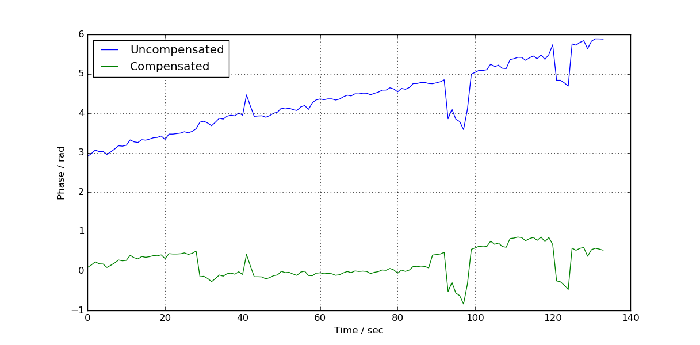
</p>
<p align="center">
Figure 9: Plot showing phase variation over time, for Solar observation, with and without intrasample compensation.
</p>


<p align="center">
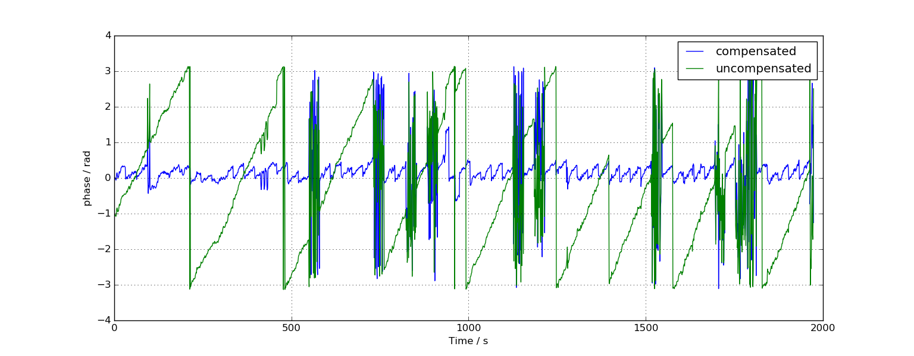
</p>
<p align="center">
Figure 10: Plot showing phase variation over time, for Solar observation, with and without intrasample compensation for observations of APR-14 2021.
</p>

## Evaluation of code run time and efficiency calculation of the Correlator 

The correlator is deployed on a server class Dell machine, with a Intel(R) Xeon(R) CPU E3-1220 v6 @ 3.00GHz processor containing 4 cores, with 16 GB of volatile memory. The current bottleneck for the Correlator is the read/write speed of the HDD. The HDD used in this server class machine is ST1000NM0018-2F2130 which essentially has a read/write speed of 193.66 MB/sec, giving a total read time of two 2GB unit files of ~22 seconds. The FORTRAN90 code used for the FFT takes about 12-15 secs to process 2 million 512 point transforms and hence makes up ~40% of the total run time of a single correlator unit. To improve this one can use multiple machines as a bewoulf clusture, using MPI, by distributing these correlator process units to different nodes to process them concurrently. Another solution to improve the efiicieny is to have NVMe or SSD based storage, especially the NVMe's claimed sequential read write speeds being above atleast 2.5 GB/s-7GB/s (https://www.samsung.com/semiconductor/global.semi.static/Samsung_NVMe_SSD_980_PRO_with_Heatsink_Datasheet_211101.pdf), reading the stored voltage and performing 2 million 512 point FFT even using an exsisting Xeon E3-1220 v6 processor should reduce the processing time to ~17 sec from current representing a improvement of ~50%. The table below shows the distribution of the current runtime between the processes.  

| Process       				| Run time (sec)|
| ----------------------------------------------| ------------- |
| Decoding pipeline and delay compensation	|     ~22	|
| FFT Kernel  					|     ~15   	|
|Total						|     ~37	|
